# -Physical-Verification-using-SKY130
## Table of content 
+ .[Day2 Lab](#day2-lab)
+ .[Day3]
+ .[Day5]

## Day2 Lab
### Day 2 Lab GDS read, ports, 

Create a work envirement copiing magic into a directory:
```mihaihmo@pv-workshop-05:~/lab2/mag$ cp /usr/share/pdk/sky130A/libs.tech/magic/sky130A.magicrc ./.magicrc```

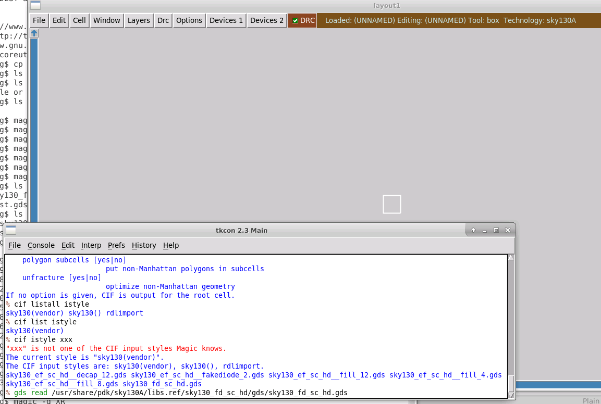

Exploring styles : available styles , selected style → Vendor 

Magics has a search databas with .mag extension ; GDS files do not have such a database so we need to point the file from the PDK,
GDS is just reading the top level cels to insert in the ;ayout you ca use the cell manager.
The selected 

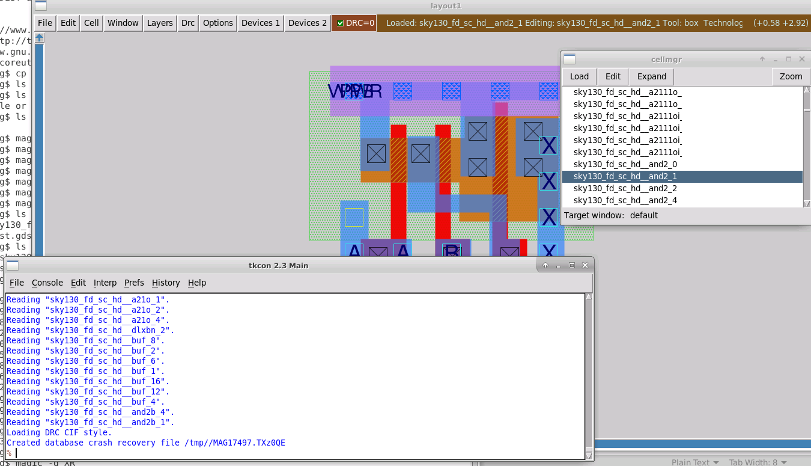

Changing style , 
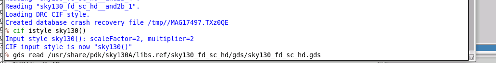


Port parameters : name, class, usage can be  used to identify the port parameters.
This are not available or are different for different styles. This metadata if not contained in the gds file, is captured in oder files like .lef file or .spice.
For spice data a script named ```readspice``` is used.

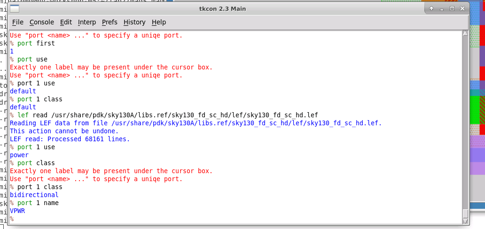
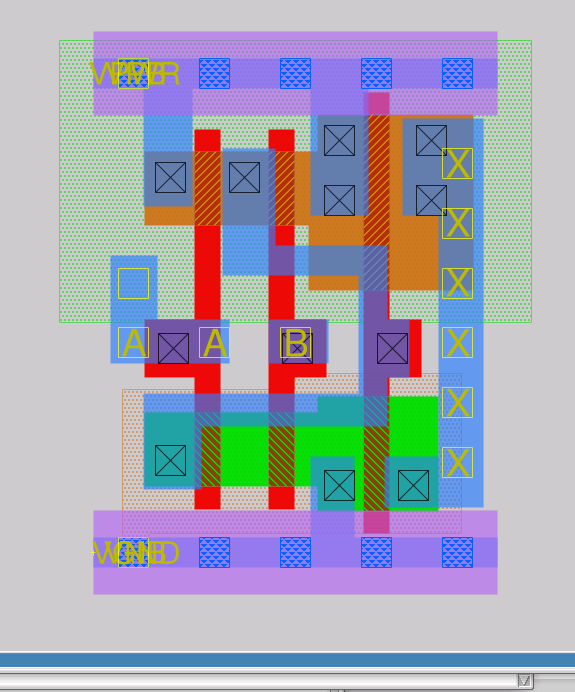


Abstract views:
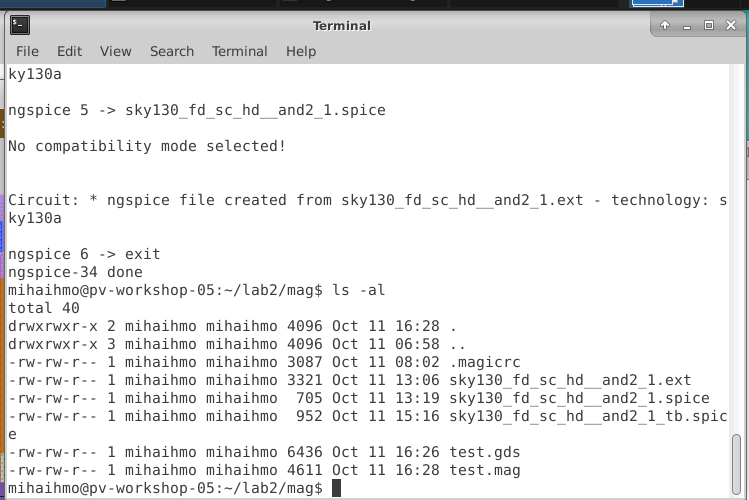

Layout generated for “test” not cel name sky130…..

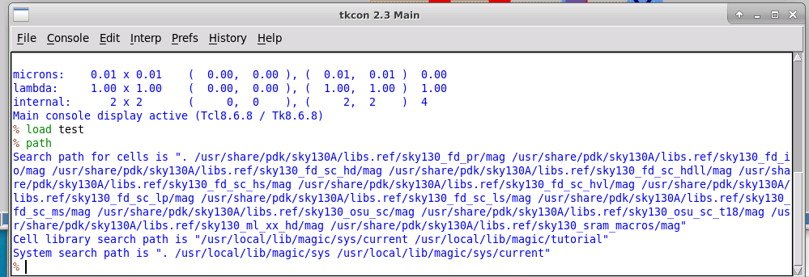

Pointers to directories from PDK

### Extraction 

```ext2spice lvs ```
```ext2spice cthresh 0.01``` - enables the generation of parasitic capacitors with the value greater then 0,01pF
```extresist tolerance xx``` – generates resistance values , threshold for the values that will generate resistior networks  . 
```extresist``` - this will generate also a file .res.ext
```ext2spice extresist on``` – enable the data in the spice model , this is used mainly in analog design or cell characterization due to high computing needs.

```ext2sim lablel on ```
```ext2sim ```– give 2 file with extension .sim (used by IR tools) and .nodes.

### DRC Setup 

Running the following script :```/usr/share/pdk/sky130A/libs.tech/magic/run_standard_drc.py /usr/share/pdk/sky130A/libs.ref/sky130_fd_sc_hd/mag/sky130_fd_sc_hd__and2_1.mag ```
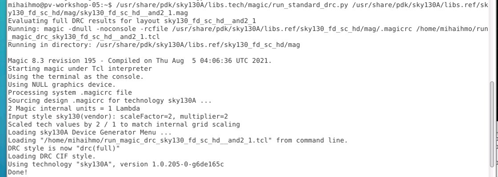

Will generate a txt file (sky130_fd_sc_hd__and2_1_drc.txt) and will setup the ```style (drc (full))```.
Opening the txt file we see that reports errors.
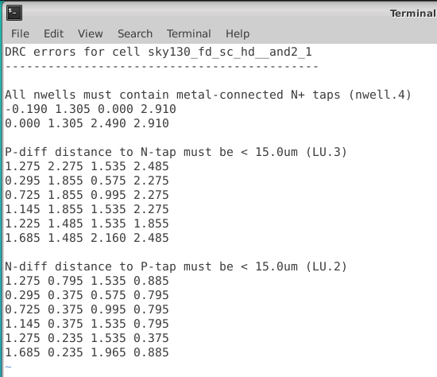
In magic we can explore the drc styles by loading the nand gate . We see that there are different styles and the one that is selected :

By default magic is not running DRC check on components that are coming from vendors.
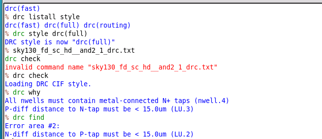

Running DRC check will highlight the errors.
After selection of and area and by using drc why command we will get the detailed errors like in the txt file.

If is needed to higlight on layout an error from the comand line use drc find 
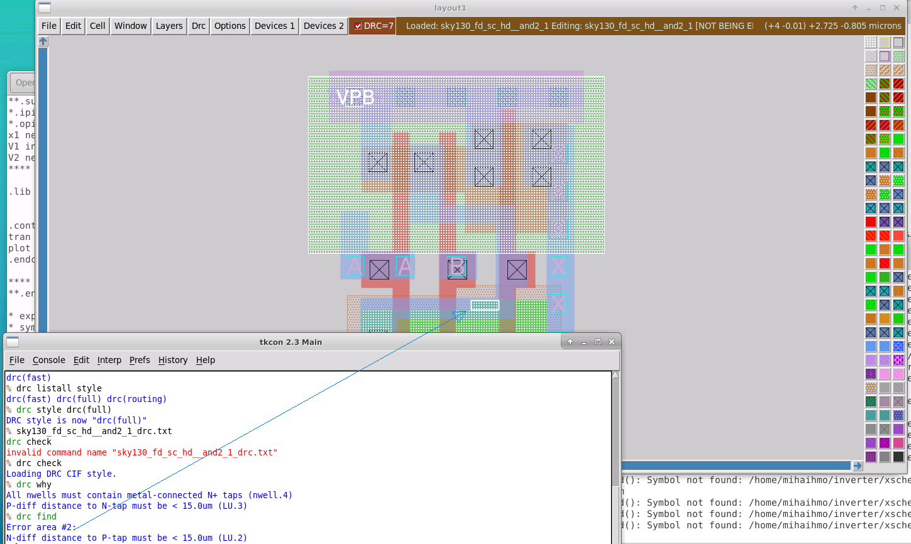

In the next example we over a n-tap cell over the and gate and the errors on the and gate disappeared because the new cell solved the previous errors 
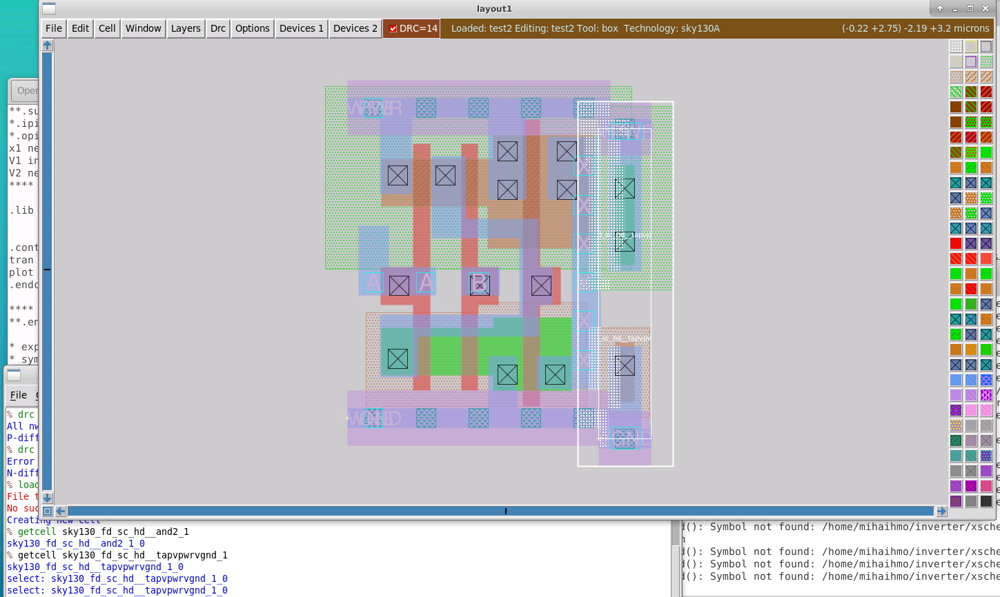

The errors disappears just in the top layer of the design , if we descend in the cel data we still see the errors .  


### Running LVS

It is recommended to generate a separate folder because  LVS will generate multiple files that are not used by magic.
Run netgen in batch mode to compare 2 netlists. Common is to input the layout first and what you compare with last.
```netgen -batch lvs "../mag/sky130_fd_sc_hd__and2_1.spice sky130_fd_sc_hd__and2_1" "/usr/share/pdk/sky130A/libs.ref/sky130_fd_sc_hd/spice/sky130_fd_sc_hd.spice sky130_fd_sc_hd__and2_1"```

You get a report if the files match or not ending :
Result: Netlists do not match.
Logging to file "comp.out" disabled
LVS Done.

Setup for XOR example:

Create 2 component that will have some difference .

Command flatten can be used to flatten a design 
```- nolabels ``` option will be used to eliminate label and compare just geometries.
 

## Day 3 Design Rule Checking 

### Fundamentals of design rules

Physical verification of masks generated from layout data vs foundry process rules specific for each foundry and process node.  

The masks are used for defining the components (transistors , resistor, caps) build during fabrication steps which are deposited/exposed to light/etched on a substrate - silicon wafer. 

The precision of the equipment, materials used, timings, cleanliness in the fabs will generate some constrains for the geometries used for masks. The defects (spot defects)  will not be eliminated completely but they will have a normal distribution and will generate a process yield. 

The DRC scope is to maintain the same failure rate (ppm-parts per million) on all wafers so we can rely on the statistics given by the fab. DRC will keep the manufacturability of the wafer , if not fulfilled most probably the fab will refuse to produce the component.

Skywater130 process rules: https://antmicro-skywater-pdk-docs.readthedocs.io/en/latest/rules.html

### Back-end Metal layer
- Minimum width: for metal, for implants, for features size (polysilicon layer) that defines the transistor gate/ length (ex: sky130 poly width >150nm)
- Spacing which usually generates short circuits (ex: if wires go parallel for a longer distance need more spacing) , wide-spacing rule (if a metal area is bigger that addition spacing is required for the neighboring wires) 
- Notch rules are usually spacing rules and they are merged together  
- Area rules (min, max) : for metals usually eliminates the possibility of delamination of metal layers and influences the vias parameters , for implants/diffusion to have enough material exposed .  
- Minimum hole area for metals so the metal will not fill the need holes
- Contact cut for vias need minimum hole to aligning the tot/ bottom metals with the via hole in the oxide layer , minimum surrounding area on the metal layers. 
Magic draw vias as single layers that comprise top+bottom poly layers, metal contact cut and local interconnect 

### Interconnect rules
It is specific to skywater 130 process , many other processes go from polysilicon layer directly to the first aluminum layer. Polysilicon has high resistance , sometimes is coated with some special high resistive material but still not good for routing.
Because the resistivity of the interconnect layer (Ti) is still higher some more like design guideline must be fulfilled : aspect ration of uncontacted local interconnect >1:10 so no long wires.
All terminals should be contacted to metal 1.

### Front-end
Most of designers will use standard cells and PDK will take care automatically . 
Parameters of transistor :channel width , polysilicon with , endcap length , source/drain length., gate poly to gate spacing
Poly to diffusion spacing , not to form a transistor by mistake. 
Rules are defined also for implant areas for wells and taps, wells connected to different voltage nets,  deep n-well.
High voltage rules for transistors that have high gate oxide and special well implants will increase almost all geometrical sizes of a transistor .
Resistors, that can be created from polysilicon material or p-diffusion material, have also specific rules .
Capacitors are :
- Varactors : that have a transitor structure -capacitance between gate and well - so the have similar rules
- MOScap: capacitors formed by gate of FET with source and drain tied together , drc rules of MOSFET
- Vertical parallel caps, Metal Oxide Metal, figure s of metal layers follow rules of metal layers
- Metal insulator Metal (MiM) caps on metal layers with thin oxide between them , specific rules . Sky130 specifies dual layer caps
Diodes - usually is a parasitic component , formed in magic with ID layers
Fixed layout devices - usually has fixed design rules from the vendor in the standard cel. Bipolar Tranz, photodiodes , sram cells, etc.

### Miscellaneous rules:
- Off-grid - not very common 
- Angle limitation 
- Seal ring : outer perimeter of a chip design - is treated like a fixed layout device but will vary when design will be resized 
- Latch-up rules :due to parasitic bipolar transistor formed between taps, wells and substrate - the rules will generate minim distance between tap connection and any diffusion zone. 
- Antenna rules: long wires can capture charges and can generate high voltages if they are not connected to a return path or load. The high voltage will penetrate components with a certain breakdown voltage, usually the transistor gate. Usually not missed by the designers this can apir during manufacturing .This can be mitigated also with placement of diodes. 
- Stres rules - related to material delamination by mechanical processes . Critical points are corners, edges usually containing the pad area.
- Density rules: is necessary to maintain a flat surface on the layers and with higher density of metal connections this is achieved easier.
Fill patterns are used to mitigate this . For analog design the patterns can influence the circuit parasitic. 

### Recommended , manufacturing and ERC rules
- Recommended rules - will not reject the layout by foundry 
- Manufacturing rules - causes rejection of layout by foundry 
- Electrical rule checks - cover electrical fail mechanisms like electromigration , overvoltage conditions 

### Day3 Lab
#### Width and spacing rules 
Clone the exercise folder from ```git clone https://github.com/RTimothyEdwards/vsd_drc_lab.git```
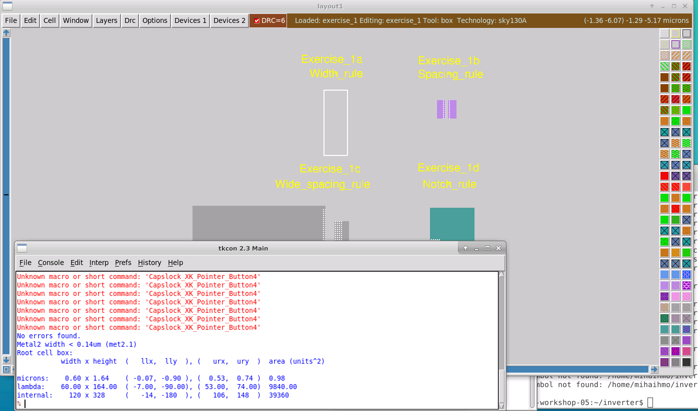

Everytime the magic starts the default drc rule is "fast".
Selecting menu DRC->DRC Report(?) errors can be seen in the command window, errors will be reported just for selection .

Use 'b' key to see dimension:
- microns: the size of the selected element (error indicated metal width 0x14 > 0.06 current width)
- lambda :
- internal: minimum manufacturing grid
Grid features can be selected from menu Window. Set grid x.xx , Grid on, Snap-to-grid etc

Exercise 1a- line width: we can use filling the area with the mouse or in command line ('''box width 0.14um / paint m2''')
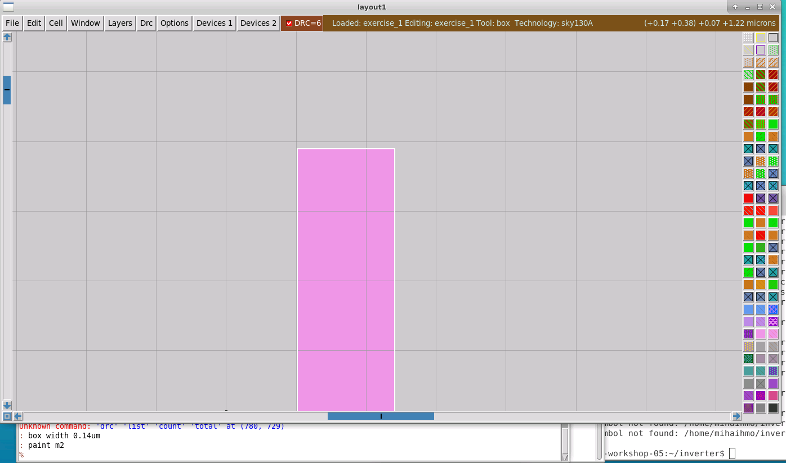
Exercise 1b - space width: solved by moving the area away with keypad arrows (4<-,6->,8 up, 2 down)
Exercise 1c - 2x metal spacing: resolved similar with 1b moving the small component
Exercise 1d - notch error : usage of menu Cell->Stretch up action is used to widen the notch or Shift +keypad arrows 
Stretch of element can be don selecting a portion of a plane , pressing a and using command ```stret e 1.1.6um``` (e - est).
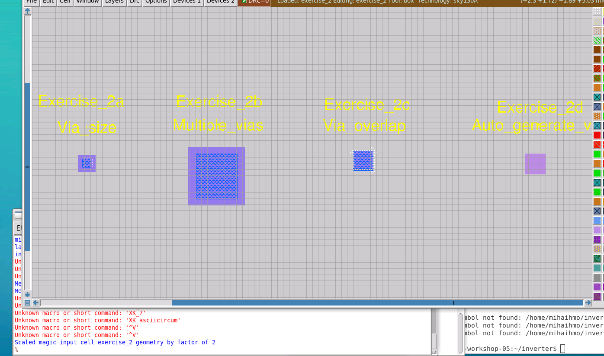

Exercise 2a via size - solved with stretch 
Exercise 2b multiple via - used in designs with multiple via contacts . ```feedback why``` command can show the possible via connection . ```feedback clear``` will reset the view.
If the area is to small to feet a contact we will get a feedback error.
```cif see``` will show the layers used for via contact.
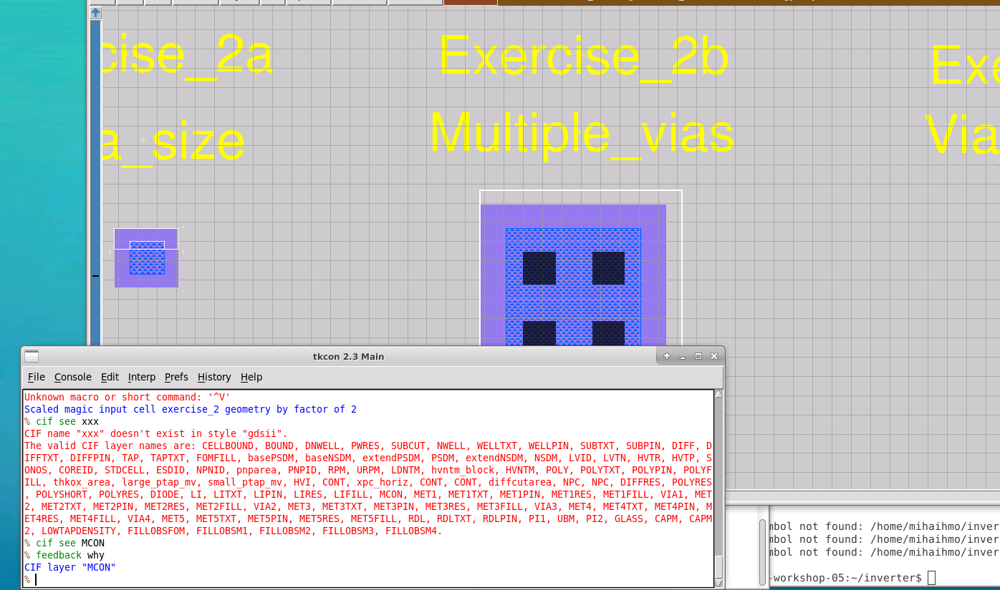
Exercise 2c - via overlap. metal layer must be generated around the via hole and dimension according to the rules .
Exercise 2d - autogenerate via: Using wiring tool hitting the space bar.  Wiring can be generated and pressing Shit+ left mouse click and Shift +right mouse click we can jump to high/lower layers. 
When going to upper layers and the width rule increases magic is generating wider traces. With ```cif see comand```  
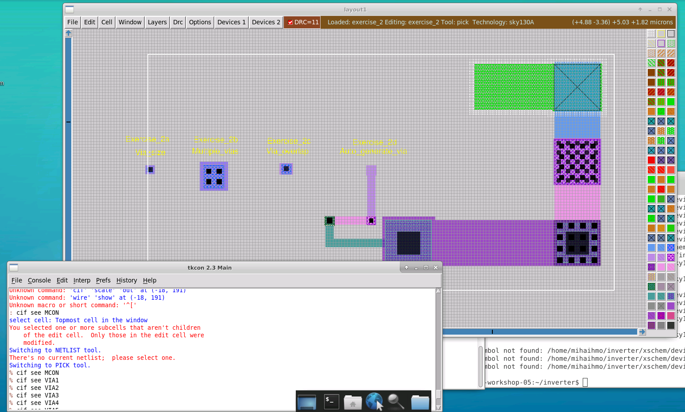

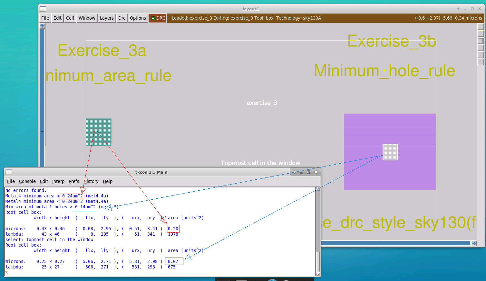
Exercise 3a - Minimum area : encountered mainly when a connection is done between layers , and some areas will be to small for upper layers rules. Solved by stretching the affected area.
```box size 0.20um 0.20um ``` command will resize the selection box to needed size. 
Exercise 3b - Minimum hole : Solved usually by cutting the surrounding hole metal. Select area and use  ``` erase "layer name"'' command. 

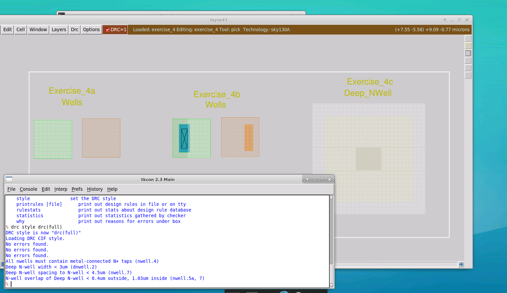
Exercise 4a :  Most well checks are compute intensive and covered just by drc(full) style. 
For this exercise the wells have no tap wells so we need to insert, painting an area with ```nsubstratendiff```` material.
Even if we insert a n-tap well we still se errors because the rules are checking for electrical connection so we need to draw a contact .
Exercise 4b :It is similar with some  intermediate step from 4a. The p-tap needs an contact and then also the interconnect area around the contact mst be adjusted. 
Exercise 4c : Is is a deep n-well structure that is not alow to flow . Is has also some width and spacing (to other n-wells) errors solved by stretching the area . ```move e 1.2um``` command is useful to move selected areas. 
Nex step is to add n-well area around the deep n-well and to add some contacts. But for such structures is recommended to generate a guard ring. 
To generate such structures magic has an option in the ```Device1``` menu called ```deep n-well region''' that contains all layers. 


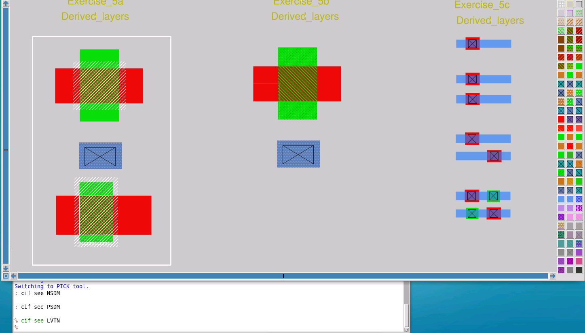
Exercise 5 : Derived layers.
In magic if you draw a poly layer over a diffusion layer you get a transistor 
To see/highligh specific layers we can use the ```cif see "layer name"```  from the list generated by ```cif see xxx``` command .
PSDM, NSDM, LVTN are implant layers .
Transitor (mvmos) from 5b is an high voltage implant, ``` cif see HVI``` shows that the implant area extends on diffusion areas compare with transistor from 5a.
Rules will require space between low and high voltage diffusion areas.  
In 5c poly contacts require a special type , not an implant but a layer etch, nitride polycut (NPC) to ensure a firmer contact between poly and interconnect. This is usually generated automatically .
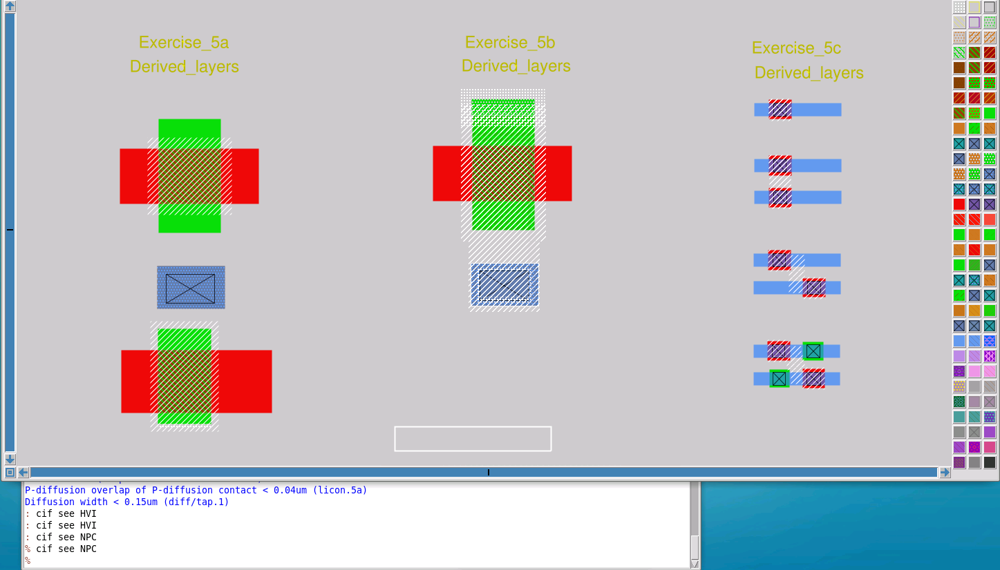

Exercise 6: Parameterized divide
When the cells do not show content ```x``` key will expand the content of the selected cells.
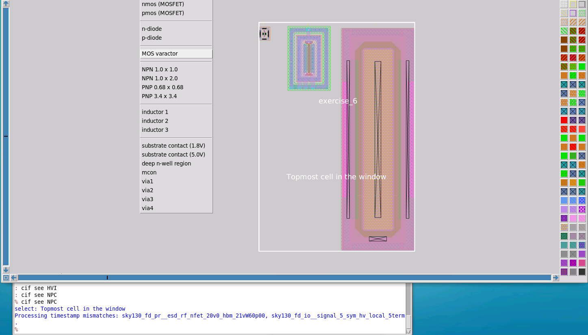
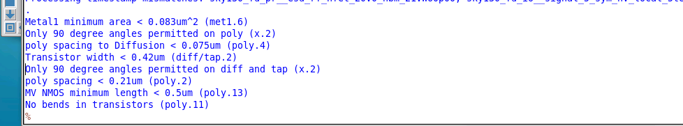
First device is a varactor with some default parameters. The metal layer minimum width can generate an error but once we connect a metal layer it will disappear.
For 6b we have an ESD FET. Here the gate has a 45 degree angle , it is know as a acceptable design but is not known by magic so this needs to be abstracted. This is very dangerous because can lead to data that will not be reflected in GDS files so it is recommended to be used just for read only cells.
TO get rid of erros the cell can be copied locally modified eliminating the angles. 
```cellname filepath "cell name"``` will get the path to the cell content. 
For 6c is similar with 6b because have in the cell geometries that are prohibited general in the design.

Exercise 7 :Angle Error And Overlap Rule
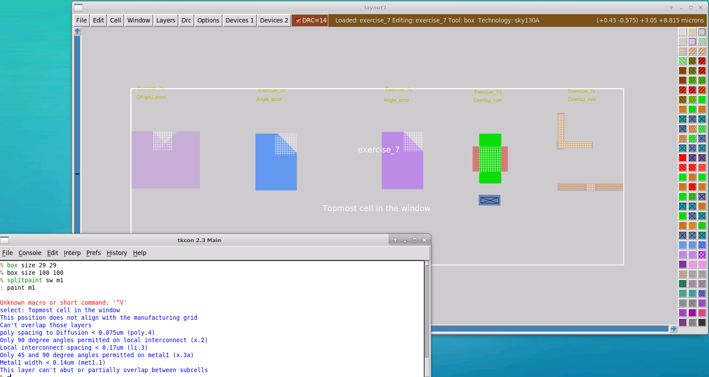
Magic is using a grid defined by the process , '''snap internal ``` will snap objects to grid, ```` scalegrid x x ``` can modified the grid if it is allowed by the process.
Triangles , although they are bad can be generate with a box and ```splitpaint "direction" "layer"``` , direction ex: sw. So some geometries will be generated that will not be aligned with the grid - solution move a component just a grid unit.
Overlap error can appear if for example poly will be in a cell and diffusion layers in other cell. Solution to paint poly over poly area and to delete a subcell. 
Contacts are not prohibited to overlap but if they do must overlap exactly .This is done automatically by magic so in case a contact cell is defined to have a certain spacing for vias and in toper hierarchy design intersect with other contact the vias can move and generate an error.


Exercise 8 : Unimplemented rules
There situations that the situation is so special that can be solved just with abstraction .
Seal ring is such a case, and can be imported just as abstract layer because is not  a part of technology . Fortunately seal ring is introduced with Seal ring generator 
 need to be redone

Exercise 9: 
In this example the design needs N-tap connection and minimum distance from diffusion area to taps must be met - this is the letch-up rule. 
We introduce manually a tap cell .
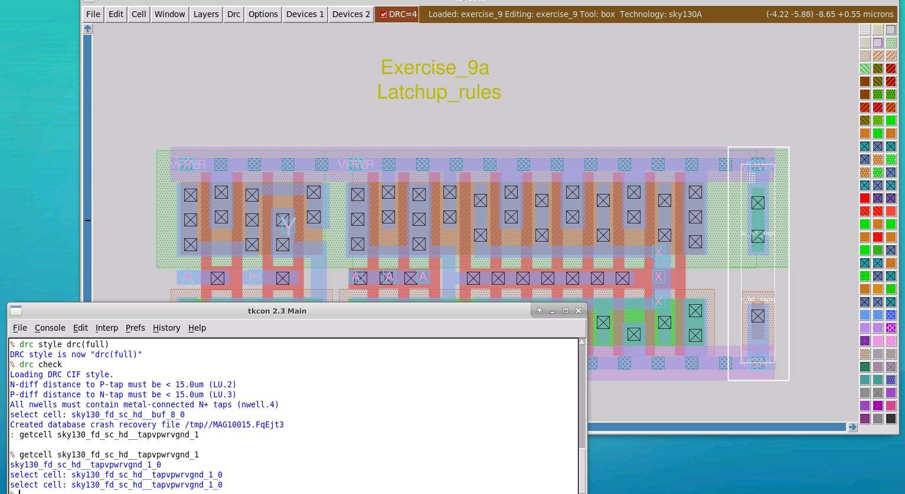

Exercise 10: Electrical rule check
For electrical rule check the behavior of the circuit must be know/ understood. For this we need an extraction  
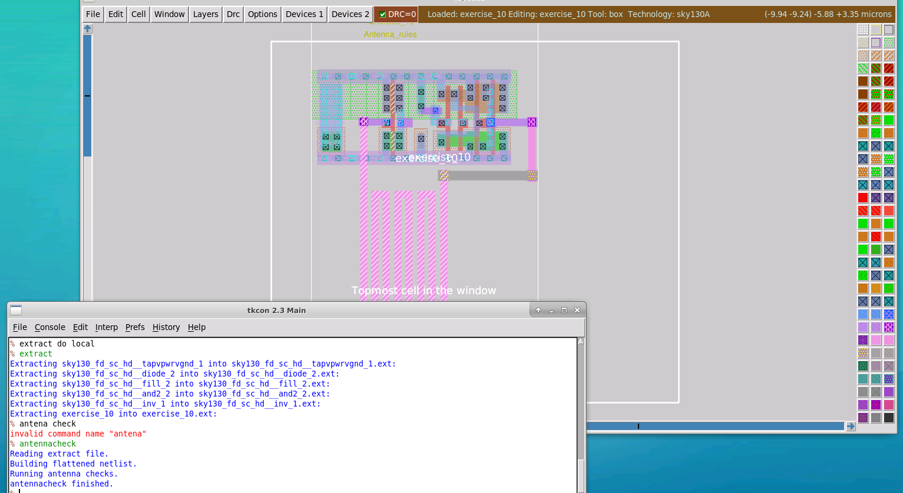
Detailed info 
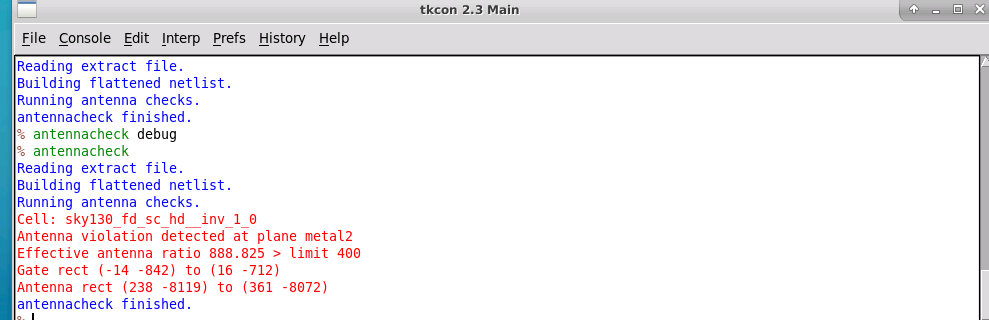
There are 2 ways to solve the antenna issues :
- connect the layer to a diode , from highlighted metal down to diffusion. there are standard diode cells
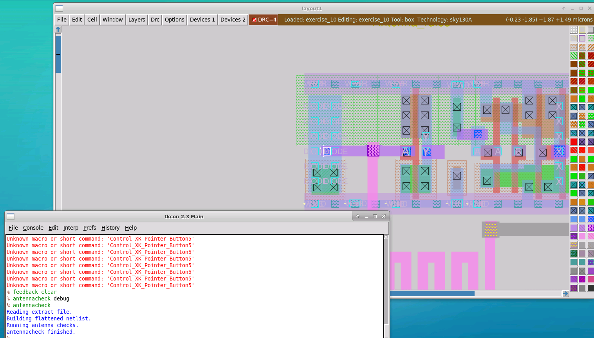
- changing metal layers the right way, for ex. the wire from metal3 moved to the metal 1

Exercise 10:Density rules
Density checks make sense on a full chip . Metal 1 covers the underdensity (~5%) and metal 2 over density (~85%) example. Use ```cif cover "layer".
Density check is done via script ```check_density.py "file.gds". To solve this use ```generate_fill.py "file.gds"```. And generates a file name "gile_fill_pattern.gds" that can be merged with original .gds. The final check will run on this final combined GDS file.
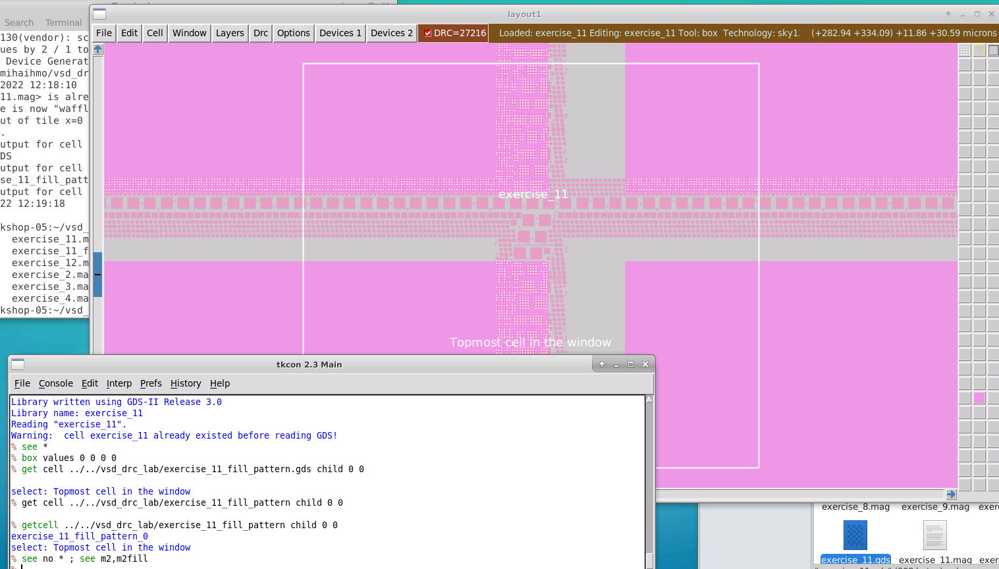

## Day5 LVS Fundamental
Basically the LVS is a comparison of a schematic generated netlist vs a layout generated netlist . 
Usually this will not math from the first time and the designers must figure out what is wrong

The tool used for this topic is "netgen" - [insert link ](http://opencircuitdesign.com/netgen/)


Netgen works with several fill types: SPICE, LEF/DEF, Verilog, BLIF. Some of them will be used for simulation and other for functional /behavioral validation.
Generating of netlists from schematic and layout tools but can derive also from RTL tools used in Verilog.
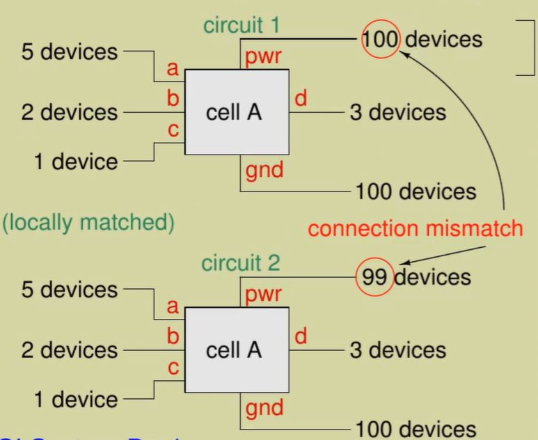
The main goal for complex designs are to maintain the hierarchical structure between schematic and layout which has some more sub cells due to structures that are repeated or do not have representation in the schematic, no electrical function.
LVS algorithm : LVS tries to look for devices that look the same , they look at the connection between them and check if they are the same. For logic aspects this looks ok but when we introduce the power connection this gets more complicated. The global network connects to every cell and every cel will flag the same error even just on cell is not correctly connected.

LVS netlist is different from the simulation netlist which contains parasitic components and this additional one will generate a mismatch. It is important to give LVS netlists without parasitic.
The number of resistances extracted can slow down the simulation so seething a relevant threshold will save time.
For Verilog designs is necessary to have netlist generated without behavioral components/ description.
The schematic and testbench files should kept separate.

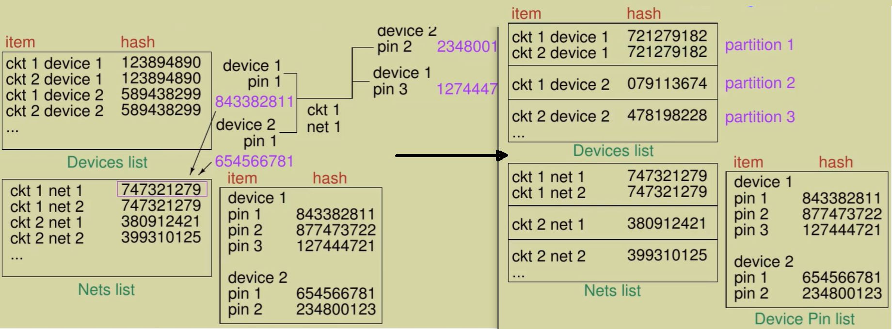
Netgen works creating a list of devices, a list of nets and generates hashes for each combination. Then creates a second set of hash numbers of the combination between hash number of device and net of the device. Then groups this hashes numbers in partitions. This repeats till the number of partitions is the same with the number of nets and devices. 
Before netgen runs the core algorithm it tries to match the circuit top devices/subcells.


# Acknowledgements
- [R. Timothy Edwards](https://github.com/RTimothyEdwards)
- [Kunal Gosh](https://github.com/kunalg123)
- [Kunal Ghosh](https://github.com/kunalg123)
- [VSD-IAT](https://vsdiat.com/)

