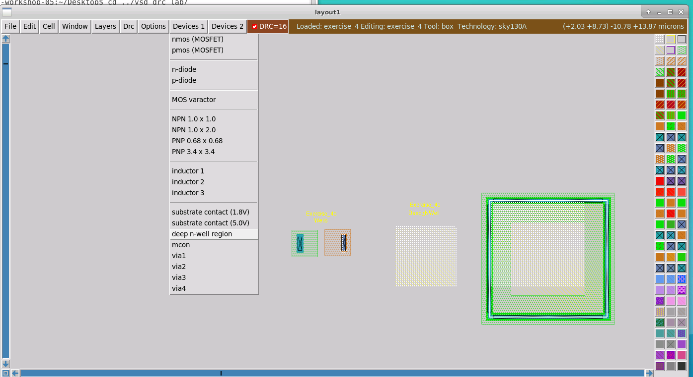

# -Physical-Verification-using-SKY130
## Day2 Lab
### GDS read, ports, 

Create a work envirement copiing magic into a directory:
‌‌```mihaihmo@pv-workshop-05:~/lab2/mag$ cp /usr/share/pdk/sky130A/libs.tech/magic/sky130A.magicrc ./.magicrc```


Exploring styles : available styles , selected style → Vendor 

Magics has a search databas with .mag extension ; GDS files do not have such a database so we need to point the file from the PDK,
GDS is just reading the top level cels to insert in the ;ayout you ca use the cell manager.
The selected 


Changing style , 


Port parameters : name, class, usage can be  used to identify the port parameters.
This are not available or are different for different styles. This metadata if not contained in the gds file, is captured in oder files like .lef file or .spice.
For spice data a script named ```readspice``` is used.


Abstract views:


Layout generated for “test” not cel name sky130…..


Pointers to directories from PDK

### Extraction 

```ext2spice lvs ```
```ext2spice cthresh 0.01``` - enables the generation of parasitic capacitors with the value greater then 0,01pF
```extresist tolerance xx``` – generates resistance values , threshold for the values that will generate resistior networks  . 
```extresist``` - this will generate also a file .res.ext
```ext2spice extresist on``` – enable the data in the spice model , this is used mainly in analog design or cell characterization due to high computing needs.

```ext2sim lablel on ```
```ext2sim ```– give 2 file with extension .sim (used by IR tools) and .nodes.

### DRC Setup 

Running the following script :```/usr/share/pdk/sky130A/libs.tech/magic/run_standard_drc.py /usr/share/pdk/sky130A/libs.ref/sky130_fd_sc_hd/mag/sky130_fd_sc_hd__and2_1.mag ```


Will generate a txt file ‌‌(sky130_fd_sc_hd__and2_1_drc.txt) and will setup the ```style (drc (full))```.
Opening the txt file we see that reports errors.

In magic we can explore the drc styles by loading the nand gate . We see that there are different styles and the one that is selected :

By default magic is not running DRC check on components that are coming from vendors.


Running DRC check will highlight the errors.
After selection of and area and by using drc why command we will get the detailed errors like in the txt file.

If is needed to higlight on layout an error from the comand line use drc find 


In the next example we over a n-tap cell over the and gate and the errors on the and gate disappeared because the new cell solved the previous errors 


The errors disappears just in the top layer of the design , if we descend in the cel data we still see the errors .  


### Running LVS

It is recommended to generate a separate folder because  LVS will generate multiple files that are not used by magic.
Run netgen in batch mode to compare 2 netlists. Common is to input the layout first and what you compare with last.
```netgen -batch lvs "../mag/sky130_fd_sc_hd__and2_1.spice sky130_fd_sc_hd__and2_1" "/usr/share/pdk/sky130A/libs.ref/sky130_fd_sc_hd/spice/sky130_fd_sc_hd.spice sky130_fd_sc_hd__and2_1"```

You get a report if the files match or not ending :
Result: Netlists do not match.
Logging to file "comp.out" disabled
LVS Done.

Setup for XOR example:

Create 2 component that will have some difference .

Command flatten can be used to flatten a design 
```- nolabels ``` option will be used to eliminate label and compare just geometries.
 

## Day 3 Design Rule Checking 

### Fundamentals of design rules

Physical verification of masks generated from layout data vs foundry process rules specific for each foundry and process node.  

The masks are used for defining the components (transistors , resistor, caps) build during fabrication steps which are deposited/exposed to light/etched on a substrate - silicon wafer. 

The precision of the equipment, materials used, timings, cleanliness in the fabs will generate some constrains for the geometries used for masks. The defects (spot defects)  will not be eliminated completely but they will have a normal distribution and will generate a process yield. 

The DRC scope is to maintain the same failure rate (ppm-parts per million) on all wafers so we can rely on the statistics given by the fab. DRC will keep the manufacturability of the wafer , if not fulfilled most probably the fab will refuse to produce the component.

Skywater130 process rules: https://antmicro-skywater-pdk-docs.readthedocs.io/en/latest/rules.html

### Back-end Metal layer
- Minimum width: for metal, for implants, for features size (polysilicon layer) that defines the transistor gate/ length (ex: sky130 poly width >150nm)
- Spacing which usually generates short circuits (ex: if wires go parallel for a longer distance need more spacing) , wide-spacing rule (if a metal area is bigger that addition spacing is required for the neighboring wires) 
- Notch rules are usually spacing rules and they are merged together  
- Area rules (min, max) : for metals usually eliminates the possibility of delamination of metal layers and influences the vias parameters , for implants/diffusion to have enough material exposed .  
- Minimum hole area for metals so the metal will not fill the need holes
- Contact cut for vias need minimum hole to aligning the tot/ bottom metals with the via hole in the oxide layer , minimum surrounding area on the metal layers. 
Magic draw vias as single layers that comprise top+bottom poly layers, metal contact cut and local interconnect 

### Interconnect rules
It is specific to skywater 130 process , many other processes go from polysilicon layer directly to the first aluminum layer. Polysilicon has high resistance , sometimes is coated with some special high resistive material but still not good for routing.
Because the resistivity of the interconnect layer (Ti) is still higher some more like design guideline must be fulfilled : aspect ration of uncontacted local interconnect >1:10 so no long wires.
All terminals should be contacted to metal 1.

### Front-end
Most of designers will use standard cells and PDK will take care automatically . 
Parameters of transistor :channel width , polysilicon with , endcap length , source/drain length., gate poly to gate spacing
Poly to diffusion spacing , not to form a transistor by mistake. 
Rules are defined also for implant areas for wells and taps, wells connected to different voltage nets,  deep n-well.
High voltage rules for transistors that have high gate oxide and special well implants will increase almost all geometrical sizes of a transistor .
Reistors, that can be created from polysilicon material or p-diffusion materiaal, have also specifc rules .
Cpacitor are :
- Varactors : that have a transitor structure -capacitance between gate and well - so the have similar rules
- MOScap: capacitors formed by gate of FET with source and drain tied toghether , drc rules of MOSFET
- Vertical parallel caps, Metal Oxide Metal, figer s of metal layers follow rules of metal layers
- Metal insulator Metal (MiM) caps on metal layers with thin oxid between them , specific rules . Sky130 specifies dual layer caps
Diodes - usually is a parasitic component , formed in magic with ID layers
Fixed layout devices - usually has fixed design rules from the vendor in the standard cel. Bipolr Tranz, photodiodes , sram cells, etc.

### Miscelaneos rules:
- Off-grid - not very comon 
- Angle limitation 
- Seal ring : outer perimeter of a chip design - is treated like a fixed layout device but will vary when design will be resized 
- Latchup rules :due to parasitic bipolar transistor formed betwen taps, wells and substrate - the rules will generate minum disctance bewteen tap connection and any diffusion zone. 
- Antenna rules: long wires can capture charges and can generate high voltages if they are not connected to a return path or load. The high voltage will penetrate components with a certain brakedown voltage , usualy the transitor gate. Usually not missed by the designers this can apair during manufacturing .Thsi can be mitigated also with placement of diodes. 
- Stres rules - related to material delamination by mechanical processes . Critical points are corners, edges usaaly containing the pad area.
- Desnity rules: is necesary to mantain a flat surface on the layers and with higher desnity of metal conections this is achieved easier.
Fill patterns are used to mitigate this . For analog design the patterns can influence the circuit parasitics. 

### Reomanded , manufacturing and ERC rules
- Recomened rules - will not reject the layout by foundry 
- Manufacturing rules - causes rejection of layout by foundry 
- Electrical rule checks - cober lectrical fail mecanisms like lectromigration , overvoltage conditions 

### Day3 Lab
#### Width and spacing rules 
Clone the exercise folder from ```git clone https://github.com/RTimothyEdwards/vsd_drc_lab.git```


Everetime the magic starts the default drc rule is "fast".
Selecting menu DRC->DRC Report(?) erros can be seen in the comand window, erros will be repoted just for selection .

Use 'b' key to see dimension:
- microns: the size of the selected elemen (error indicated metal width 0x14 > 0.06 curent width)
- lambda :
- internal: minimum manufaturing grid
Grid features can be selected from menu Window. Set grid x.xx , Grid on, Snap-to-grid etc

Exercise 1a- line width: we can use filling the area with the mouse or in comand line ('''box width 0.14um / paint m2''')

Exercise 1b - space width: solved by moving the area away with keypad arrows (4<-,6->,8 up, 2 down)
Exercise 1c - 2x metal spacing: rsolved similar with 1b moving the small component
Exercise 1d - notch error : usgae of menu Cell->Strech up action is used to widthen the notch or Shift +keypad arraows 
Strech of element can be don selecting a portion of a plane , pressing a and using comand ```stret e 1.1.6um``` (e - est).


Exercise 2a via size - solved with strech 
Exercise 2b multiple via - used in designs with multiple via contacts . ```feedback why``` comand can show the possible via conection . ```feeback clear``` will reset the view.
If the area is to small to feet a contact we will get a feedback error.
```cif see``` will show the layers used for via contact.

Exercise 2c - via overlap. metal layer must be generated aroudn the via hole and dimension acording to the rules .
Exercise 2d - autogenerate via: Using wiring tool hitting the space bar.  Wiring can be generated and presing Shit+ left mouse click and Shift +right mouse click we can jump to high/lower layers. 
When going to upper layers and the width rule incrieses magis is generating wider traces. With ```cif see comand```  


Exercise 3a - Minimum area : encountered mainly when a conection is done between layers , and some areas will be to small for upper layers rules. Solved by strechting the affected area.
```box size 0.20um 0.20um ``` comand will resize the selection box to needed size. 
Exercise 3b - Minimum hole : Solved usually by cutting the surounding hole metal. Select area and use  ``` erase "layer name"'' command. 


Exercise 4a :  Most well checks are comput intensive and covered just by drc(full) style. 
For this exercise the wells have no tap wells so we need to insert, paintind an area with ```nsubstratendiff```` material.
Even if we insert a n-tap well we still se errors becasue the rulles are cheching for electrical connection so we need to draw a contact .
Exercise 4b :It is similar with some  intermidiat step from 4a. The p-tap needs an contact and then also the interconect area around the contact mst be adjusted. 
Exercise 4c : Is is a deep n-well structure that is not alow to flow . Is has also some width and spacing (to other n-wells) errors solved by strecthing the area . ```move e 1.2um``` comand is usfull to move selected areas. 
Nex step is to add n-well area around the deep n-well and to add some ocntacts. But for such structures is recomandaed to generate a guard ring. 
To generate such structures magic has an option in the ```Device1``` menu called ```deep n-well region''' that contains all layers. 



Exercise 5 : Deived layers.
In magic if you draw a poly layer over a difussion layer you get a transistor 
To see/highligh specific layers we can use the ```cif see "layer name"```  from the list generated by ```cif see xxx``` commnad .
PSDM, NSDM, LVTN are implant layers .
Transitor (mvmos) from 5b is an high voltage implant, ``` cif see HVI``` shows that the implant area extends on difussion areas compare with transistor from 5a.
Rules will require space between low and high voltage diffusion areas.  
In 5c poly contacts require a scpeaicl type , not an implat but a layer etch, nitride policut (NPC) to ensure a firmer contact between poly and interconect. This is usually generated automaticly .


Exercise 6: Parameterized deivde
When the cells do not show content ```x``` key will expand the content of the selected cells.


First device is a varactor with some default parameters. The metal layer minimum width can generate an error but once we conect a metal layer it will disapear.
For 6b we have an ESD FET. Here the gate has a 45 degree angle , it is know as a aceptable design but is not known by magic so this needs to be abstracted. This is very ddangerous because can lead to data that will not e reflected in GDS files so it is recomanded to be used just for read only cells.
TO get rid of erros the cell can be copied locally modified eliminating the angles. 
```cellname filepath "cell mname"``` will get the path to the cell content. 
For 6c is similar with 6b becasue have in the cell geometries that are prohibited general in the design.

Exercise 7 :Angle Error And Overlap Rule

Magic is using a grid defined by the process , '''snap internal ``` will snap objects to grid, ```` scalegrid x x ``` can modified the grid if it is alowed by the process.
Triangles , although they are bad can be generate with a box and ```splitpaint "direction" "layer"``` , direction ex: sw. So some geometries will be generated that will not be alliagned with the grid - solution move a component just a grid unit.
Overlap error can apear if for eaxple poly will be in a cell and difussion layers in other cell. Solution to paint poly over poly area and to delete a subcell. 
Contacts are not prohibited to overlap but if they do must overlap exaclty .This is done autoticly by magic so in case a contact cell is defined to have a ciertain spacing for vias and in toper hierachy design intersect with other contact the vias can move and generate an error.


Exercise 8 : Unimplemened rules
There situations that the situation is so special that can be solved just with abstractiuon .
Seal ring is such a case, and can be imported just as abstract layer becasue is not  a part of technology . Fortunatly seal ring is introduced with Seal ring generator 
 need to be reedone

Exercise 9: 
In this example the design neeeds N-tap conection and minimum distance distance from difusion area to taps must be met - this is the lecth-up rule. 
We introduce manually a tap cel .


Exercise 10: Eletrical rule check
For electrical rule check the behaviour of the circuit must be know/ understood. For this we need an extractioin  

Detailed info 

There are 2 ways to solve the antenna issues :
- conect the layer to a diode , from higluted metal down to fiddiusion. there are standard diode cels

- chenahign metal layers the right way , for ex. the wire from metal3 moved to temetal 1

Exercise 10:Density rules
Density checks make sens on a full chip . Metal 1 covers the undedesnity (~5%) and metal 2 over desntisty (~85%) example. Use ```cif cover "layer".
Density check is done via script ```check_density.py "file.gds". To solve this use ```generate_fill.py "file.gds"```. ANd generates a file name "gile_fill_pattern.gds" that can be merged with original .gds. The final check will run on this final comabined GDS file.


## Day5 LVS Fundamental


# Acknowledgements
- [R. Timothy Edwards](https://github.com/RTimothyEdwards)
- [Kunal Gosh](https://github.com/kunalg123)
- [Kunal Ghosh](https://github.com/kunalg123)
- [VSD-IAT](https://vsdiat.com/)

